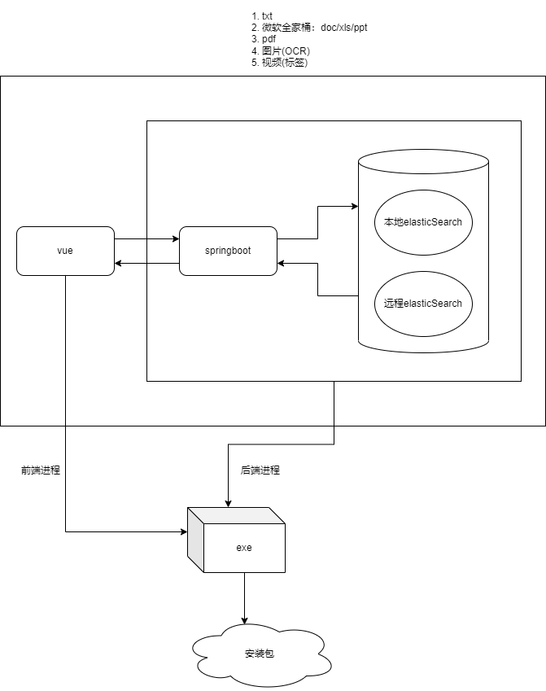

# 1 初衷

由于工作中写了很多笔记，而且大多数笔记是记录在txt中的，记录的内容根据公司规定这些信息只能存放本地而不能上传到云端，那么以后的某一天如果想要找某个东西就会很困难，得一个文件一个文件地打开去找，更别说文件类型不单单只有txt格式的，还有微软的全家桶，像doc/xls/ppt，或者说有些转成了pdf，或许还有以图片类型存储的信息。

因此，这个以es引擎为基础的文件内容搜索项目诞生了，也是之后以`Evolution`开头的第1个项目。

我命名为：`Evolution: Search`

# 2 项目环境

## 2.1 后端

* JAVA: 17.0.3.1
* maven: 3.8.6
* spring-boot-starter-parent: 3.0.0

## 2.2 前端

* nodejs: 16.15.1
* vue: 3.2.45

# 3 项目版本号说明

版本号分为由3个整数构成：

```
    ddd.ddd.ddd
    |    \    \
    |      \    \
大版本更新   \     \
            年月  小版本号
```

# 4 项目架构简单说明

